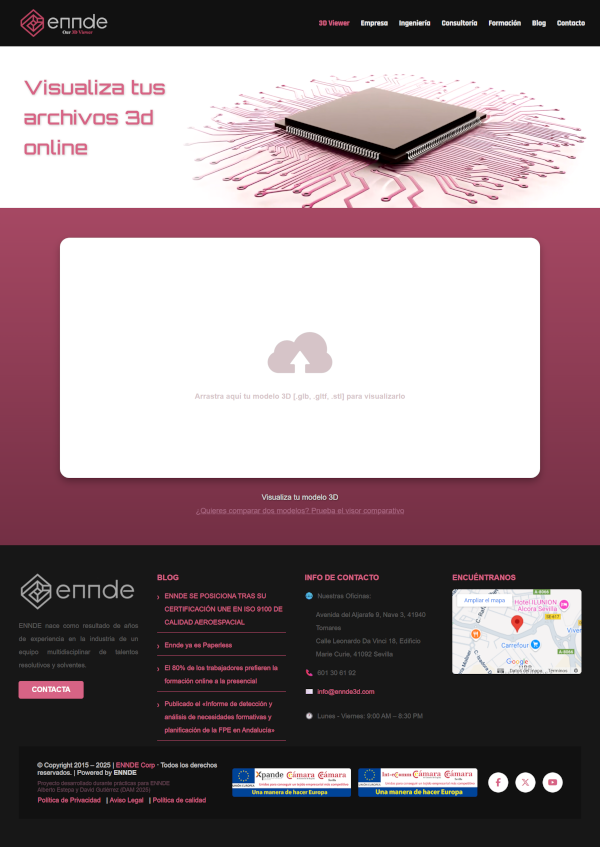
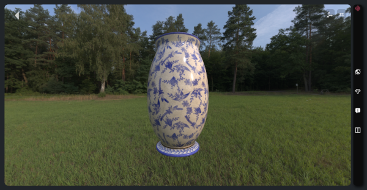
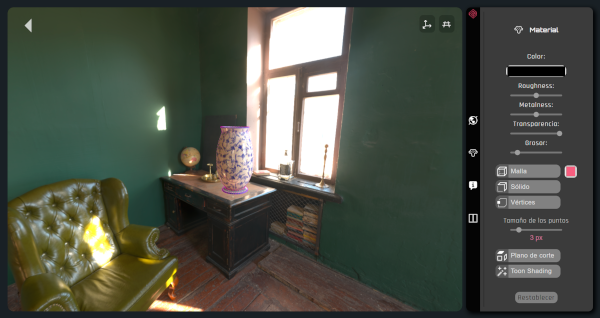
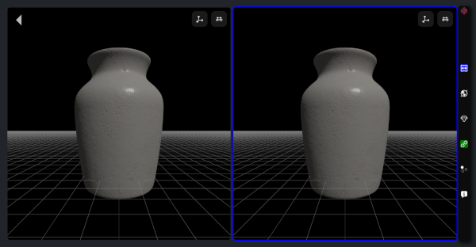
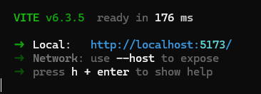

# Visor Web 3D ENNDE

Visor web interactivo para la visualización, comparación y análisis de modelos 3D en formatos estándar (GLB, GLTF, STL), desarrollado como proyecto de prácticas para ENNDE3D (DAM Ilerna 2024-2025).



---

## Descripción

Esta aplicación permite cargar modelos 3D, inspeccionarlos desde el navegador y comparar dos piezas mediante alineado por puntos clave. Incluye herramientas avanzadas de visualización (entornos HDRI, plano de corte, nube de puntos, Toon Shading), personalización de materiales y modos de cámara.

Pensado para flujos de trabajo profesionales (arte, patrimonio, ingeniería, diseño industrial...), el visor es modular, intuitivo y adaptable.

---

## Características principales

- **Carga de modelos 3D:** arrastrar y soltar archivos `.glb`, `.gltf`, `.stl` o seleccionarlos manualmente.
- **Visor individual y comparativo:** inspección libre o comparación alineada de dos modelos.
- **Alineado guiado:** selección de puntos clave para alineación precisa.
- **Herramientas de análisis:** plano de corte, nube de puntos, Toon Shading.
- **Sincronización de visores:** movimientos/cortes aplicables simultáneamente.
- **Personalización de entorno:** HDRI, color de fondo, ajustes de cámara.
- **UI adaptativa:** menú lateral contextual, atajos de teclado, ayuda rápida.
- **Gestión local de archivos pesados:** uso de IndexedDB para modelos grandes.





---

## Instalación rápida

1. **Requisitos previos**
    - [Node.js](https://nodejs.org/) instalado.
    - Navegador moderno (Chrome, Firefox, Edge...).

2. **Instalación de dependencias**
    ```bash
    npm install
    ```

3. **Arrancar el proyecto**
    ```bash
    npx vite
    ```
    Accede a la URL que aparece (ejemplo: `http://localhost:5173/`).
    

4. **Primer uso**
    - Ve al apartado **3D Viewer**.
    - Arrastra tu modelo o selecciónalo manualmente.
    - Usa los menús laterales para activar herramientas y personalizar la visualización.
    - Cambia a modo comparativo para alinear y comparar dos modelos.

---

## Tecnologías principales

- **Three.js** – Motor de gráficos 3D para web.
- **JavaScript (ES6), HTML5, CSS3**
- **Vite** – Entorno de desarrollo rápido.
- **Bootstrap** – Estilos y estructura responsive.
- **IndexedDB** – Almacenamiento local de archivos.
- **Git y GitHub** – Control de versiones y colaboración.

---

## Autores

- [Alberto Estepa Gómez](https://github.com/SantanaOlmo)
- [David Gutiérrez Ortiz](https://github.com/DavidLazaro08)

Prácticas de ciclo **DAM** (Ilerna 2024-2025) en **ENNDE3D**.

---

## Recursos útiles

- [Three.js manual](https://threejs.org/manual/)
- [Descarga de HDRIs](https://polyhaven.com/)
- [Ejemplos de visores 3D](https://sketchfab.com/3d-models)

---

> Para detalles completos del desarrollo, funcionalidades avanzadas, retos técnicos y estructura del proyecto, consulta la **memoria adjunta** | [Memoria_Visor_Web3D_ENNDE_DAM2025.pdf](./doc/Memoria_Visor_Web3D_ENNDE_DAM2025_VRS2.pdf).
